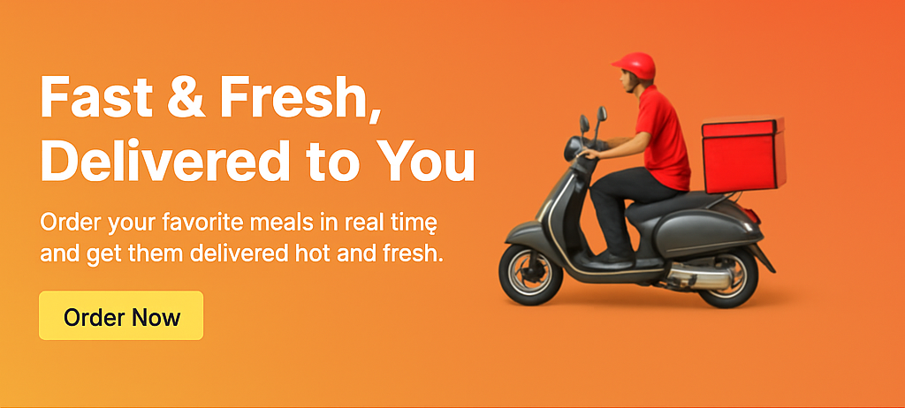

# Ex02 Commercial Website
## Date: 08-08-2025
## Name : Soundarya J
## Reg no: 212223220108

## AIM
To create a commercial website using CSS Flexbox.

## ALGORITHM
### STEP 1
Create an HTML file (index.html)

### STEP 2
Create a CSS file (style.css)

### STEP 3
Include a navigation bar with links to different sections.

### STEP 4
Add structured sections for Homepage, Products / Services, About Us, Contact Details and User Account.

### STEP 5
Include social media links at the footer with copyright information.

### STEP 6
Define global styles for fonts, colors, and layout.

### STEP 7
Style the header, navigation bar, and sections.

### STEP 8
Use Flexbox for layout design.

### STEP 9
Add hover effects and transitions for interactivity.

### STEP 10
Add Images and Media.

### STEP 11
Use optimized images for a professional look.

### STEP 12
Open the HTML file in a browser to check layout and functionality.

### STEP 13
Fix styling issues and refine content placement.

### STEP 14
Deploy the website.

### STEP 15
Upload to GitHub Pages for free hosting.

## PROGRAM
## index.html
```
<!DOCTYPE html>
<html lang="en">
<head>
    <meta charset="UTF-8">
    <meta name="viewport" content="width=device-width, initial-scale=1.0">
    <title>QuickBite - Food Delivery</title>
    <link rel="stylesheet" href="style.css">
</head>
<body>
    <header>
        <div class="logo">QuickBite</div>
        <nav>
            <ul class="nav-links">
                <li><a href="#home">Home</a></li>
                <li><a href="#menu">Menu</a></li>
                <li><a href="#about">About Us</a></li>
                <li><a href="#contact">Contact</a></li>
                <li><a href="#account">Account</a></li>
            </ul>
        </nav>
    </header>
    <section id="home" class="home-section">
        <h1>Fast & Fresh, Delivered to You</h1>
        <p>Order your favorite meals in real time and get them delivered hot and fresh.</p>
        
    
    </section>
    <section id="menu" class="products-section">
        <h2>Popular Dishes</h2>
        <div class="product-container">
            <div class="product-card">
                
                <h3>Cheese Pizza</h3>
                <p>₹250</p>
            </div>
            <div class="product-card">
                
                <h3>Chicken Burger</h3>
                <p>₹180</p>
            </div>
            <div class="product-card">
                
                <h3>Italian Pasta</h3>
                <p>₹200</p>
            </div>
        </div>
    </section>
    <section id="about" class="about-section">
        <h2>About QuickBite</h2>
        <p>QuickBite is your go-to food delivery app, connecting you with local restaurants in real-time for fast and fresh meals.</p>
    </section>
    <section id="contact" class="contact-section">
        <h2>Contact Us</h2>
        <p>Email: help@quickbite.com</p>
        <p>Phone: +91 9876543210</p>
    </section>

   

    
    <footer>
        <div class="social-links">
            <a href="#">Facebook</a> | 
            <a href="#">Instagram</a> | 
            <a href="#">Twitter</a>
        </div>
        <p>&copy; 2025 QuickBite. All Rights Reserved.</p>
    </footer>

</body>
</html>
```
##  style.css
```
* {
    margin: 0;
    padding: 0;
    box-sizing: border-box;
}

body {
    font-family: Arial, sans-serif;
    line-height: 1.6;
}

a {
    text-decoration: none;
    color: white;
}

h1, h2, h3 {
    margin-bottom: 10px;
}


header {
    display: flex;
    justify-content: space-between;
    align-items: center;
    background: #e63946;
    color: white;
    padding: 15px 30px;
}

.logo {
    font-size: 24px;
    font-weight: bold;
}

.nav-links {
    display: flex;
    list-style: none;
}

.nav-links li {
    margin-left: 20px;
}

.nav-links a:hover {
    color: #ffd166;
    transition: 0.3s;
}


.home-section {
    display: flex;
    flex-direction: column;
    align-items: center;
    justify-content: center;
    height: 60vh;
    color: white;
    text-align: center;
}

.order-btn {
    background: #ffd166;
    padding: 10px 20px;
    border-radius: 5px;
    margin-top: 15px;
    color: #333;
    font-weight: bold;
}

.order-btn:hover {
    background: #ffb703;
}

.products-section {
    padding: 40px;
    background: #f4f4f4;
}

.product-container {
    display: flex;
    justify-content: space-around;
    flex-wrap: wrap;
    gap: 20px;
}

.product-card {
    background: white;
    border-radius: 8px;
    padding: 20px;
    width: 250px;
    text-align: center;
    transition: transform 0.3s;
}

.product-card img {
    width: 100%;
    border-radius: 8px;
}

.product-card:hover {
    transform: scale(1.05);
}


.about-section, .contact-section, .account-section {
    padding: 40px;
    text-align: center;
}


footer {
    background: #e63946;
    color: white;
    text-align: center;
    padding: 15px;
}

.social-links a {
    color: #ffd166;
}
```


## OUTPUT


## RESULT
The program for creating commercial website using CSS Flexbox is executed successfully.
